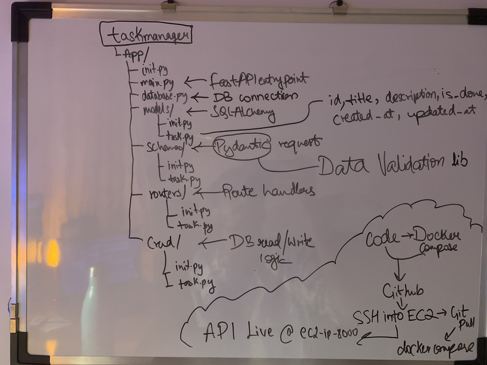

# Task Manager API

A production-ready REST API built with FastAPI, PostgreSQL, and Docker — deployed on AWS EC2.

🔴 **Live API:** [http://34.235.121.79:8000](http://34.235.121.79:8000)

---

## Architecture



The diagram above shows the complete project structure and deployment flow — from folder layout to live API on EC2.

---

## Tech Stack

| Layer | Technology |
|---|---|
| Framework | FastAPI |
| Server | Uvicorn (ASGI) |
| Database | PostgreSQL 15 |
| ORM | SQLAlchemy |
| Validation | Pydantic v2 |
| Migrations | Alembic |
| Containerization | Docker + Docker Compose |
| Deployment | AWS EC2 (Ubuntu 22.04) |

---

## Project Structure

```
taskmanager/
├── app/
│   ├── __init__.py
│   ├── main.py              # FastAPI entry point
│   ├── database.py          # DB connection, session factory, Base class
│   ├── models/
│   │   ├── __init__.py
│   │   └── task.py          # SQLAlchemy table definition
│   ├── schemas/
│   │   ├── __init__.py
│   │   └── task.py          # Pydantic request/response models
│   ├── routers/
│   │   ├── __init__.py
│   │   └── tasks.py         # Route handlers
│   └── crud/
│       ├── __init__.py
│       └── task.py          # DB read/write logic
├── alembic/                 # Migration files
├── Dockerfile
├── docker-compose.yml
├── requirements.txt
├── .env                     # Secret config (not committed)
└── .env.example             # Safe template for teammates
```

---

## API Endpoints

| Method | Endpoint | Description |
|---|---|---|
| GET | `/` | Health check |
| GET | `/tasks/` | Get all tasks (paginated) |
| GET | `/tasks/{id}` | Get a single task |
| POST | `/tasks/` | Create a new task |
| PATCH | `/tasks/{id}` | Partially update a task |
| DELETE | `/tasks/{id}` | Delete a task |

---

## Getting Started

### Prerequisites

- Docker
- Docker Compose v2

### 1. Clone the repository

```bash
git clone https://github.com/yourusername/taskmanager.git
cd taskmanager
```

### 2. Set up environment variables

```bash
cp .env.example .env
```

Edit `.env` with your values:

```
DATABASE_URL=postgresql://postgres:password@db:5432/taskdb
POSTGRES_USER=postgres
POSTGRES_PASSWORD=password
POSTGRES_DB=taskdb
```

### 3. Run with Docker

```bash
docker compose up --build
```

### 4. Access the API

| URL | Description |
|---|---|
| `http://localhost:8000/` | Health check |
| `http://localhost:8000/docs` | Swagger UI (interactive) |
| `http://localhost:8000/redoc` | ReDoc documentation |

---

## Example Request

**Create a task**

```bash
curl -X POST http://localhost:8000/tasks/ \
  -H "Content-Type: application/json" \
  -d '{"title": "Buy milk", "description": "From the store", "is_done": false}'
```

**Response**

```json
{
  "id": 1,
  "title": "Buy milk",
  "description": "From the store",
  "is_done": false,
  "created_at": "2026-05-26T14:30:00",
  "updated_at": null
}
```

---

## Database Schema

```sql
CREATE TABLE tasks (
    id          SERIAL PRIMARY KEY,
    title       VARCHAR NOT NULL,
    description VARCHAR,
    is_done     BOOLEAN DEFAULT FALSE,
    created_at  TIMESTAMPTZ DEFAULT NOW(),
    updated_at  TIMESTAMPTZ
);
```

---

## Deployment (AWS EC2)

### 1. Launch EC2 instance
- OS: Ubuntu 22.04 LTS
- Instance type: t2.micro (free tier)
- Open inbound ports: 22 (SSH), 80 (HTTP), 8000 (API)

### 2. Install Docker on EC2

```bash
sudo apt update
sudo apt install docker.io -y
sudo systemctl start docker
sudo systemctl enable docker
sudo usermod -aG docker ubuntu

sudo mkdir -p /usr/local/lib/docker/cli-plugins
sudo curl -SL https://github.com/docker/compose/releases/download/v2.24.0/docker-compose-linux-x86_64 \
  -o /usr/local/lib/docker/cli-plugins/docker-compose
sudo chmod +x /usr/local/lib/docker/cli-plugins/docker-compose
```

### 3. Copy project to EC2

```bash
scp -i your-key.pem -r ./taskmanager ubuntu@YOUR_EC2_IP:~/
```

### 4. Run on EC2

```bash
cd taskmanager
docker compose up --build -d
```

API is now live at `http://YOUR_EC2_IP:8000/docs`

---

## Environment Variables

| Variable | Description |
|---|---|
| `DATABASE_URL` | Full PostgreSQL connection string |
| `POSTGRES_USER` | PostgreSQL username |
| `POSTGRES_PASSWORD` | PostgreSQL password |
| `POSTGRES_DB` | Database name |

---

## Future Improvements

- [ ] JWT authentication (user login/signup)
- [ ] User model with Task ownership
- [ ] Unit and integration tests (pytest)
- [ ] Nginx reverse proxy (port 80 → 8000)
- [ ] CI/CD pipeline (GitHub Actions)
- [ ] Environment-based config (dev/staging/prod)

---

## License

Apache License 2.0